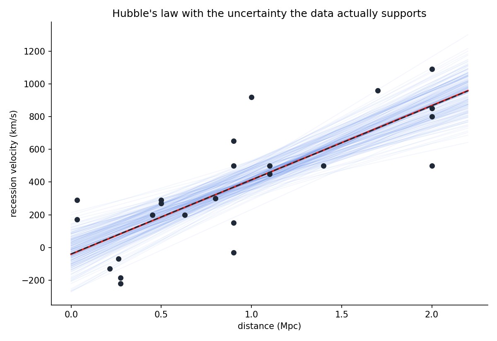
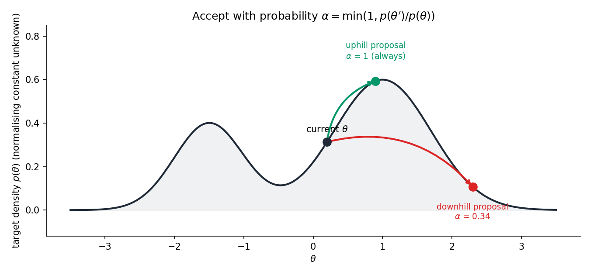
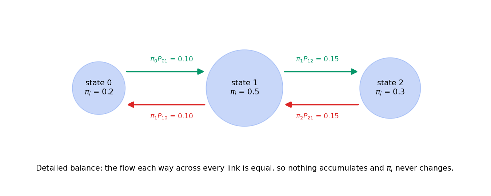
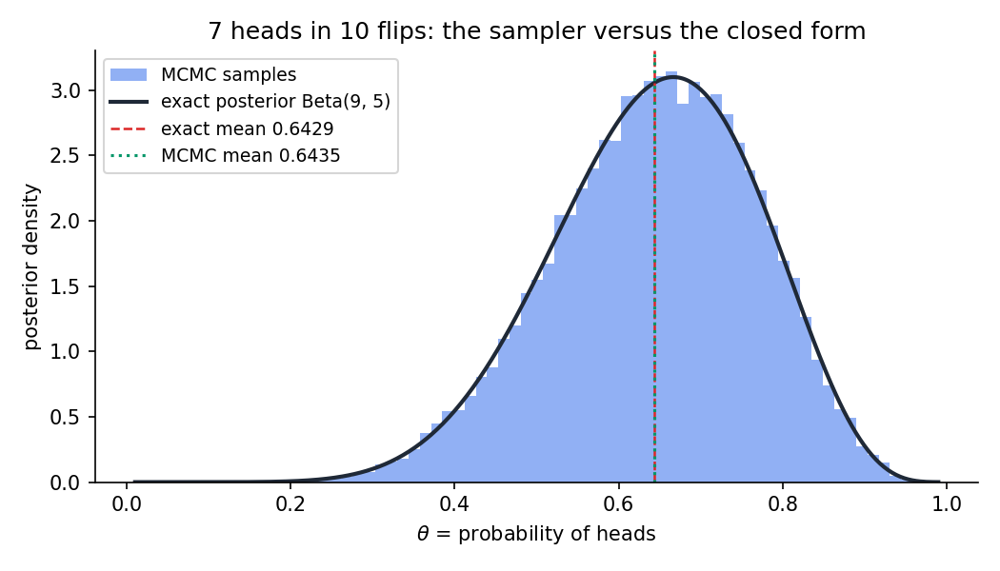
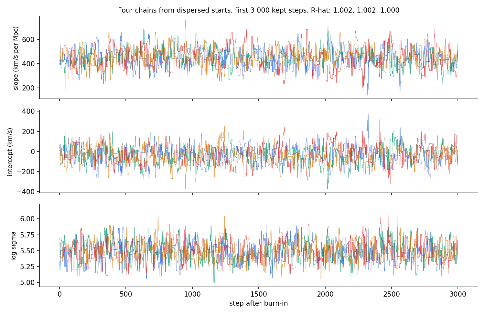
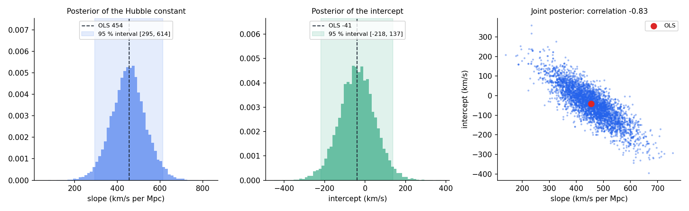
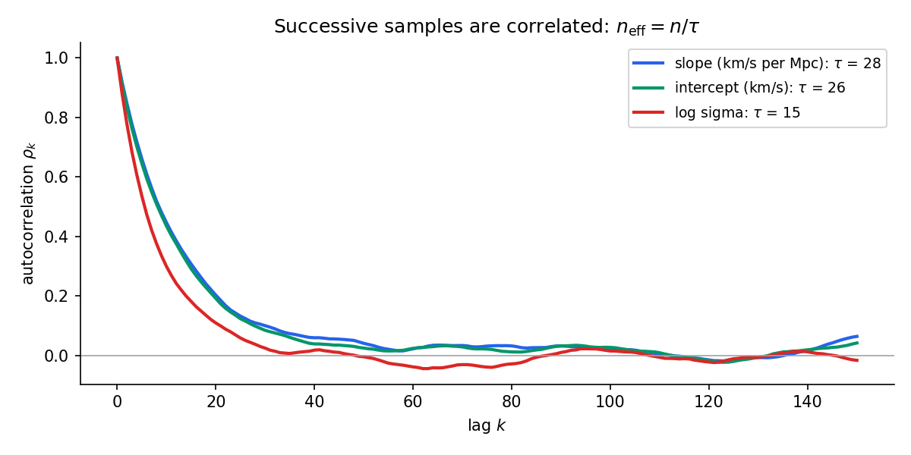
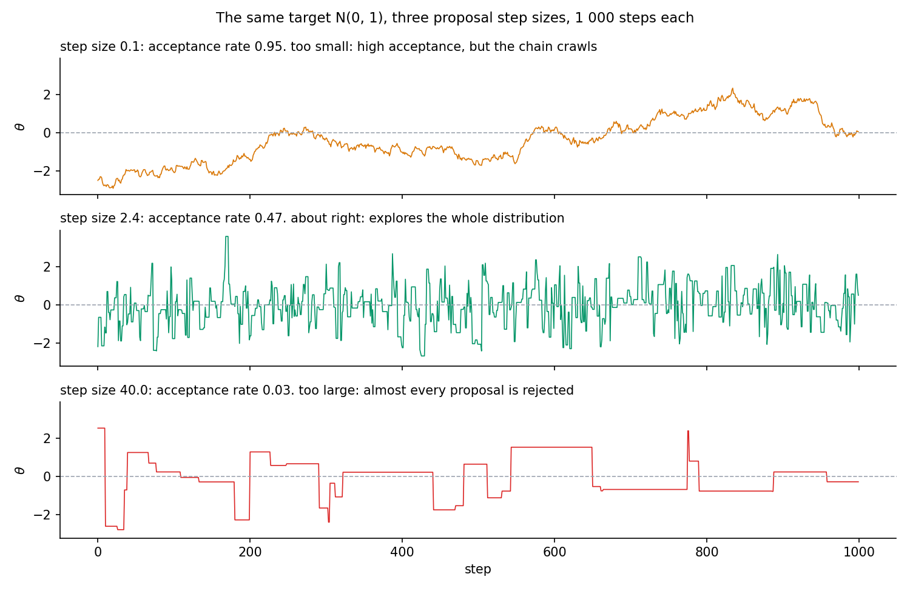

# 04 · Markov Chain Monte Carlo From Scratch

 

**Question.** Bayes' theorem gives the posterior as likelihood times prior,

divided by an integral that is usually impossible to compute. How can I

draw samples from a distribution I can only evaluate up to a constant, and

how do I know the samples are right?

 

**Answer.** Build a random walk whose long-run distribution *is* the

posterior. The Metropolis–Hastings rule does this with one line of algebra,

and the reason it works (detailed balance) is a four-line proof. A 40-line

sampler recovers a closed-form posterior to within its Monte Carlo error,

and fitting Hubble's 1929 data gives the Hubble constant as

$453 \pm 80$ km/s per Mpc, an uncertainty that ordinary least squares alone

does not show.

 



 

---

 

## Contents

 

1. [The idea in one paragraph](#1-the-idea-in-one-paragraph)

2. [Two worked examples you can do by hand](#2-two-worked-examples-you-can-do-by-hand)

3. [The derivations](#3-the-derivations)

4. [Verification](#4-verification)

5. [Results](#5-results)

6. [Numerical lessons learned](#6-numerical-lessons-learned)

7. [How to run](#7-how-to-run)

8. [Code map](#8-code-map)

 

---

 

## 1. The idea in one paragraph

 

A posterior distribution $p(\theta \mid D)$ is proportional to

$p(D \mid \theta)\, p(\theta)$, and both factors are easy to write down. The

constant of proportionality is $\int p(D \mid \theta)\, p(\theta)\, d\theta$,

which for anything beyond a textbook example has no closed form. Markov

chain Monte Carlo sidesteps it: start anywhere, propose a random step,

and accept it with a probability that depends only on the *ratio*

$p(\theta') / p(\theta)$, in which the constant cancels. Uphill steps are

always taken. Downhill steps are taken sometimes, in proportion to how far

down they go. The chain spends time in each region in proportion to its

probability, so the visited points are samples from the posterior. The

mathematics that guarantees this is a symmetry called detailed balance.

 



 

*From the current point, an uphill proposal is always accepted. A downhill

proposal is accepted with probability equal to the ratio of densities, here

0.34. Neither decision needs the normalising constant.*

 

---

 

## 2. Two worked examples you can do by hand

 

Run `python worked_example.py` to see every number below printed by the

same code that fits the Hubble data.

 

### 2.1 Three states, where the chain is a matrix

 

Target: three states with probabilities $\pi = (0.2, 0.5, 0.3)$. Proposal:

from any state, propose a neighbour with probability $\tfrac{1}{2}$ each;

at the two ends the move that would leave the state space becomes "stay".

This keeps the proposal matrix symmetric:

 

$$

Q = \begin{bmatrix} 0.5 & 0.5 & 0 \\ 0.5 & 0 & 0.5 \\ 0 & 0.5 & 0.5 \end{bmatrix}

$$

 

The Metropolis acceptance probability for a proposed move $i \to j$ is

$\alpha_{ij} = \min\!\left(1, \pi_j / \pi_i\right)$:

 

$$

\alpha_{01} = \min\!\left(1, \tfrac{0.5}{0.2}\right) = 1, \quad

\alpha_{10} = \min\!\left(1, \tfrac{0.2}{0.5}\right) = 0.4, \quad

\alpha_{12} = \min\!\left(1, \tfrac{0.3}{0.5}\right) = 0.6, \quad

\alpha_{21} = \min\!\left(1, \tfrac{0.5}{0.3}\right) = 1 .

$$

 

The transition probability is $P_{ij} = Q_{ij}\,\alpha_{ij}$ for $i \ne j$,

and each diagonal entry collects whatever was rejected:

 

$$

P = \begin{bmatrix} 0.5 & 0.5 & 0 \\ 0.2 & 0.5 & 0.3 \\ 0 & 0.5 & 0.5 \end{bmatrix}

$$

 

**Stationarity.** Multiply $\pi$ by $P$:

 

$$

\pi P = \begin{bmatrix} 0.2(0.5) + 0.5(0.2) \\ 0.2(0.5) + 0.5(0.5) + 0.3(0.5) \\ 0.5(0.3) + 0.3(0.5) \end{bmatrix}^{\mathsf T}

= \begin{bmatrix} 0.2 & 0.5 & 0.3 \end{bmatrix} = \pi .

$$

 

**Detailed balance.** The probability flow across each link is equal in

both directions:

 

$$

\pi_0 P_{01} = 0.2 \times 0.5 = 0.10 = 0.5 \times 0.2 = \pi_1 P_{10}, \qquad

\pi_1 P_{12} = 0.5 \times 0.3 = 0.15 = 0.3 \times 0.5 = \pi_2 P_{21} .

$$

 



 

### 2.2 Three Metropolis steps on a coin

 

Seven heads in ten flips, prior $\text{Beta}(2, 2)$. The unnormalised log

posterior is $\log p(\theta) = 8 \log\theta + 4 \log(1 - \theta)$ (derived

in section 3.7). Start at $\theta = 0.5$, propose $\theta' = \theta + 0.1\,z$

with $z \sim \mathcal N(0, 1)$, seed 0.

 

| step | current $\theta$ | proposal $\theta'$ | $\log p(\theta') - \log p(\theta)$ | $\alpha$ | draw $u$ | decision |

|---|---|---|---|---|---|---|

| 1 | 0.5000 | 0.5126 | $-8.2210 + 8.3178 = +0.0968$ | 1.0000 | 0.2698 | accept, uphill |

| 2 | 0.5126 | 0.5766 | $-7.8425 + 8.2210 = +0.3785$ | 1.0000 | 0.0165 | accept, uphill |

| 3 | 0.5766 | 0.5230 | $-8.1460 + 7.8425 = -0.3035$ | $e^{-0.3035} = 0.7382$ | 0.9128 | reject, $u \ge \alpha$, stay at 0.5766 |

 

Step 3 is the whole algorithm in one line: the proposal was downhill, it

would have been accepted 74 % of the time, and this time the coin came up

against it.

 

---

 

## 3. The derivations

 

### 3.1 Bayes' theorem and the unnormalised posterior

 

For parameters $\theta$ and data $D$,

 

$$

p(\theta \mid D) = \frac{p(D \mid \theta)\, p(\theta)}{p(D)},

\qquad

p(D) = \int p(D \mid \theta')\, p(\theta')\, d\theta' .

$$

 

The denominator does not depend on $\theta$. Writing

$\tilde p(\theta) = p(D \mid \theta)\, p(\theta)$ for the numerator,

 

$$

\frac{p(\theta' \mid D)}{p(\theta \mid D)} = \frac{\tilde p(\theta')}{\tilde p(\theta)} .

$$

 

Any algorithm that only ever looks at ratios of posterior densities never

needs $p(D)$. Metropolis–Hastings is such an algorithm.

 

### 3.2 Markov chains, stationarity, and detailed balance

 

A Markov chain on states $i, j, \dots$ is defined by transition

probabilities $P_{ij} = \Pr(\text{next} = j \mid \text{now} = i)$, with

$\sum_j P_{ij} = 1$. A distribution $\pi$ is **stationary** if running the

chain one step from $\pi$ leaves it unchanged:

 

$$

\pi P = \pi, \qquad \text{that is} \qquad \sum_i \pi_i P_{ij} = \pi_j \ \text{for every } j .

$$

 

The chain satisfies **detailed balance** with respect to $\pi$ if

 

$$

\pi_i P_{ij} = \pi_j P_{ji} \qquad \text{for every pair } i, j .

$$

 

**Theorem.** Detailed balance implies stationarity.

 

**Proof.** Sum the detailed-balance identity over $i$:

 

$$

\sum_i \pi_i P_{ij} = \sum_i \pi_j P_{ji} = \pi_j \sum_i P_{ji} = \pi_j \cdot 1 = \pi_j . \qquad \blacksquare

$$

 

Detailed balance is the stronger, easier condition: it is a statement

about each pair of states separately, and it is what the Metropolis rule is

built to satisfy. (Stationarity plus irreducibility and aperiodicity also

give convergence to $\pi$ from any start; those two conditions hold for a

Gaussian random walk on a continuous target with positive density.)

 

### 3.3 The Metropolis–Hastings acceptance rule

 

Let $q(\theta' \mid \theta)$ be the proposal density and define

 

$$

\alpha(\theta \to \theta') = \min\!\left(1,\

\frac{\tilde p(\theta')\, q(\theta \mid \theta')}{\tilde p(\theta)\, q(\theta' \mid \theta)}\right).

$$

 

The transition density for an actual move $\theta \to \theta' \ne \theta$ is

$P(\theta \to \theta') = q(\theta' \mid \theta)\, \alpha(\theta \to \theta')$.

 

**Theorem.** This chain satisfies detailed balance with respect to

$p(\theta \mid D)$.

 

**Proof.** Fix $\theta \ne \theta'$ and write $r$ for the ratio inside the

$\min$. Exactly one of $r \le 1$ or $r > 1$ holds; the two cases are mirror

images, so take $r \le 1$. Then $\alpha(\theta \to \theta') = r$ and the

reverse ratio is $1/r \ge 1$, so $\alpha(\theta' \to \theta) = 1$.

 

$$

\begin{aligned}

\tilde p(\theta)\, P(\theta \to \theta')

&= \tilde p(\theta)\, q(\theta' \mid \theta)\,

   \frac{\tilde p(\theta')\, q(\theta \mid \theta')}{\tilde p(\theta)\, q(\theta' \mid \theta)} \\

&= \tilde p(\theta')\, q(\theta \mid \theta') \\

&= \tilde p(\theta')\, q(\theta \mid \theta')\, \alpha(\theta' \to \theta)

 = \tilde p(\theta')\, P(\theta' \to \theta) .

\end{aligned}

$$

 

Dividing both sides by $p(D)$ turns $\tilde p$ into the posterior. When

$r = 1$ both acceptance probabilities are 1 and the identity is immediate.

$\blacksquare$

 

The constant $p(D)$ appears on both sides and cancels, which is the entire

point.

 

### 3.4 Symmetric proposals

 

For the Gaussian random walk $\theta' = \theta + s\, z$, the proposal

density is $q(\theta' \mid \theta) \propto \exp\!\left(-\lVert \theta' - \theta \rVert^2 / 2s^2\right)$,

which is unchanged by swapping $\theta$ and $\theta'$. So

$q(\theta \mid \theta') / q(\theta' \mid \theta) = 1$ and the rule reduces to

the original Metropolis form

 

$$

\alpha = \min\!\left(1, \frac{\tilde p(\theta')}{\tilde p(\theta)}\right),

\qquad

\log\alpha = \min\!\left(0,\ \log\tilde p(\theta') - \log\tilde p(\theta)\right).

$$

 

The code works with the second form. Accept when $\log u < \log \alpha$ for

$u \sim \text{Uniform}(0, 1)$.

 

### 3.5 Monte Carlo error and the effective sample size

 

For $n$ *independent* samples the standard error of the mean is

$\sigma / \sqrt{n}$. MCMC samples are not independent. With

$\rho_k$ the autocorrelation at lag $k$,

 

$$

\\mathrm{SSE}{Var}(\bar x) = \frac{\sigma^2}{n}\left(1 + 2\sum_{k=1}^{\infty} \rho_k\right)

= \frac{\sigma^2}{n}\, \tau ,

\qquad

\tau = 1 + 2\sum_{k \ge 1} \rho_k .

$$

 

$\tau$ is the **integrated autocorrelation time**: the number of steps the

chain needs to produce one effectively independent sample. The

**effective sample size** is $n_{\text{eff}} = n / \tau$, and the standard

error is $\sigma / \sqrt{n_{\text{eff}}}$. Every tolerance in the tests is

a multiple of this quantity.

 

Estimating $\tau$ needs care. The true $\rho_k$ decays to zero, but the

estimated $\rho_k$ does not; it becomes noise of size about

$1/\sqrt{n}$. Summing noise over thousands of lags adds a random walk to

$\tau$. The code uses Sokal's rule: sum lags $1$ to $M$, where $M$ is the

smallest lag with $M \ge 5\,\tau_M$. That window is a few times $\tau$,

long enough to capture the decay and short enough to exclude most of the

noise.

 

### 3.6 The Gelman–Rubin statistic $\hat R$

 

Run $m$ chains of length $n$ from dispersed starting points. Let $s_j^2$

be the variance within chain $j$ and $\bar x_j$ its mean. Define

 

$$

W = \frac{1}{m}\sum_{j=1}^{m} s_j^2, \qquad

B = \frac{n}{m-1}\sum_{j=1}^{m} (\bar x_j - \bar x)^2, \qquad

\hat V = \frac{n-1}{n}\, W + \frac{1}{n}\, B, \qquad

\hat R = \sqrt{\hat V / W} .

$$

 

If every chain explores the same distribution, the between-chain spread

$B$ is what $W$ predicts and $\hat R \approx 1$. If chains are stuck in

different regions, $B$ is inflated and $\hat R > 1$. The usual threshold is

$\hat R < 1.01$.

 

### 3.7 The Beta–Binomial closed form used as a check

 

Prior $\theta \sim \text{Beta}(a, b)$ has density

$\propto \theta^{a-1}(1-\theta)^{b-1}$. The likelihood of $k$ heads in $n$

flips is $\binom{n}{k}\theta^{k}(1-\theta)^{n-k}$. Multiply:

 

$$

p(\theta \mid k) \propto \theta^{k}(1-\theta)^{n-k} \cdot \theta^{a-1}(1-\theta)^{b-1}

= \theta^{a+k-1}(1-\theta)^{b+n-k-1},

$$

 

which is the $\text{Beta}(a + k,\ b + n - k)$ density. For $a = b = 2$,

$k = 7$, $n = 10$: $\text{Beta}(9, 5)$, with mean $9/14 = 0.6429$ and

variance $9 \cdot 5 / (14^2 \cdot 15) = 0.01531$. Because the answer is

known exactly, the sampler can be checked against it to within Monte Carlo

error.

 

### 3.8 The regression model for the Hubble data

 

$$

v_i = \beta_0 + \beta_1 d_i + \varepsilon_i, \qquad \varepsilon_i \sim \mathcal N(0, \sigma^2),

$$

 

with parameters $\theta = (\beta_1, \beta_0, \log\sigma)$. The log

posterior, up to a constant, is

 

$$

\log \tilde p(\theta) = -n \log\sigma - \frac{1}{2\sigma^2}\sum_{i=1}^{n}\left(v_i - \beta_0 - \beta_1 d_i\right)^2

- \frac{\beta_1^2}{2 s_1^2} - \frac{\beta_0^2}{2 s_0^2},

$$

 

where the last two terms are Gaussian priors with $s_0 = s_1 = 2000$, wide

enough to be nearly flat over the region the data supports. The prior on

$\log\sigma$ is flat, which is equivalent to $p(\sigma) \propto 1/\sigma$

(section 6). With a flat prior the posterior mean of

$(\beta_1, \beta_0)$ is the least-squares solution, so OLS is an

independent check on the sampler.

 

---

 

## 4. Verification

 

Every test encodes a theorem or a closed-form answer. Where the answer is

a Monte Carlo estimate, the tolerance is a fixed number of standard errors

$\sigma / \sqrt{n_{\text{eff}}}$ with $n_{\text{eff}}$ estimated from the

chain itself.

 

| Test | What it checks | Tolerance |

|---|---|---|

| Three-state $P$ equals the hand calculation | section 2.1 | $10^{-15}$ |

| $\pi_i P_{ij} = \pi_j P_{ji}$ on 3 and 6 states | detailed balance (3.3) | $10^{-12}$ |

| $\pi P = \pi$ | stationarity follows (3.2) | $10^{-12}$ |

| Rows of $P$ sum to 1, entries non-negative | $P$ is a stochastic matrix | $10^{-14}$ |

| Simulated state frequencies approach $\pi$ | ergodic theorem | 0.01 after 200 000 steps |

| $\mathcal N(0, 1)$ target: mean and variance | 3.5 | 4 standard errors |

| Correlated 2-D Gaussian: sample covariance | 3.5 | 5 % relative |

| Acceptance rate near 0.44 for step $2.4\sigma$ in 1-D | Roberts, Gelman and Gilks (1997) | in $[0.35, 0.55]$ |

| Same seed gives the same chain | determinism | exact |

| Coin: mean, variance, 5 / 50 / 95 % quantiles vs $\text{Beta}(9, 5)$ | 3.7 | 4 to 6 standard errors |

| Log posterior differs from `scipy.stats.beta.logpdf` by a constant | 3.7 | $10^{-12}$ |

| White noise: $\rho_k \approx 0$, $n_{\text{eff}} \approx n$ | 3.5 | $4/\sqrt{n}$, 10 % |

| AR(1) with $\rho = 0.9$: $\tau = (1+\rho)/(1-\rho) = 19$ | 3.5 | 10 % |

| AR(1) with $\rho = 0.7$: $\rho_k = 0.7^k$ | definition of autocorrelation | 0.02 |

| $\hat R \approx 1$ for identical chains, $\hat R > 1.1$ for shifted chains | 3.6 | 0.01 |

| Regression posterior mean equals OLS | 3.8 | 4 standard errors |

| Regression log posterior equals the direct formula | 3.8 | $10^{-9}$ |

| `log_gaussian` equals `scipy.stats.multivariate_normal.logpdf` | reference | $10^{-8}$ |

 

```

$ python -m pytest tests/ -q

29 passed in 14.56s

```

 

SciPy appears only in the tests, as the reference. The sampler, the

diagnostics, and the models are NumPy.

 

---

 

## 5. Results

 

### 5.1 The coin problem against its closed form

 

100 000 steps with step size 0.25, first 2 000 discarded. Acceptance rate

0.504, $n_{\text{eff}} = 21\,792$.

 

| quantity | MCMC | exact $\text{Beta}(9, 5)$ | Monte Carlo standard error |

|---|---|---|---|

| mean | 0.6435 | 0.6429 | 0.0008 |

| variance | 0.01522 | 0.01531 | |

| 5 % quantile | 0.4270 | 0.4274 | |

| median | 0.6506 | 0.6498 | |

| 95 % quantile | 0.8322 | 0.8343 | |

 



 

The difference in the mean is 0.0006, under one standard error. The

histogram is the sampler; the curve is the theorem.

 

### 5.2 Hubble's 1929 data

 

Edwin Hubble's original table: 24 nebulae, distance in megaparsecs and

recession velocity in km/s (Hubble, *PNAS* 15(3):168–173, 1929). The slope

of velocity against distance is the Hubble constant $H_0$.

 

Four chains, each 5 000 burn-in steps then 20 000 kept, from starting

points scattered around the least-squares solution. Total time 1.2 s.

Mean acceptance rate 0.236.

 

| parameter | OLS | posterior mean | posterior sd | 95 % interval | $\hat R$ | $n_{\text{eff}}$ (of 80 000) |

|---|---|---|---|---|---|---|

| $H_0$, km/s per Mpc | 454.2 | 452.7 | 80.3 | $[294.5,\ 614.3]$ | 1.0023 | 2 927 |

| intercept, km/s | $-40.8$ | $-39.3$ | 89.0 | $[-217.8,\ 136.8]$ | 1.0024 | 3 077 |

| $\log\sigma$ | | 5.48 | 0.15 | $[5.2,\ 5.8]$ | 1.0003 | 4 974 |

| $\sigma$, km/s | 232.9 | 241.9 | 37.8 | $[182,\ 329]$ | | |

 



 

*Four chains, four colours, first 3 000 kept steps. They are

indistinguishable, which is what $\hat R \approx 1$ says numerically.*

 



 

*Left and middle: marginal posteriors, with the OLS point estimate as a

dashed line and the 95 % interval shaded. Right: the joint posterior of

slope and intercept, correlation $-0.83$. A steeper line must cross the

axis lower to still pass through the data.*

 



 

*Successive samples are correlated for about 30 steps. The integrated

autocorrelation time is 28 for the slope, so 80 000 samples are worth

about 2 900 independent ones.*

 

**What the numbers say.** The posterior mean agrees with OLS to well

within Monte Carlo error (the standard error of the posterior-mean

estimate is $80.3 / \sqrt{2927} \approx 1.5$). What OLS does not give

directly is the shape of the uncertainty: with 24 points and a residual

scatter of about 240 km/s, the data support any slope from roughly 300 to

600. Hubble's value of about 450 km/s per Mpc is roughly seven times the

modern value of about 70. The reason is not statistical: his distances,

calibrated on stars he believed were Cepheid variables, were systematically

too small by a large factor. The posterior faithfully reports the

uncertainty in the data it was given; it cannot know the data are biased.

 

---

 

## 6. Numerical lessons learned

 

**Work in log space, always.** The log posterior at the least-squares

point for the Hubble data is about $-142$, so the posterior density itself

is around $e^{-142} \approx 10^{-62}$. That is still representable in

double precision, but a data set ten times larger at the same scale would

give $e^{-1400}$, which underflows to exactly $0.0$ and turns every

acceptance ratio into $0/0$. Logarithms turn products into sums and keep

every number ordinary. The acceptance test becomes

$\log u < \log\tilde p(\theta') - \log\tilde p(\theta)$, and a proposal

outside the support has $\log\tilde p = -\infty$, so

$\log\alpha = -\infty$ and the comparison correctly rejects it without a

special case. The one special case that is needed is the starting point:

if $\theta_0$ itself has $\log\tilde p = -\infty$, the difference is

$-\infty - (-\infty) = \text{NaN}$ and every comparison is False forever.

The sampler raises an error instead.

 

**80 000 samples were worth about 3 000.** The integrated autocorrelation

time for the slope was 28. A chain that looks long is not: the honest

sample size is $n / \tau$, and every reported uncertainty about a posterior

mean has to use it. Skipping this step is the most common way to overstate

the precision of an MCMC result.

 

**The step size has a sweet spot, and the acceptance rate finds it.**

A step of $0.1\sigma$ on a standard Gaussian accepted 95 % of proposals

and went nowhere; a step of $40\sigma$ accepted 3 % and stood still

between rare jumps. The efficient middle is around $2.4\sigma$ in one

dimension (acceptance near 0.44) and shrinks as $2.4/\sqrt{d}$ with

dimension (acceptance near 0.23). The three-parameter Hubble run landed

at 0.236 with step sizes set to about $1.3$ posterior standard deviations

per coordinate.

 



 

**Correlated parameters slow an isotropic random walk.** Slope and

intercept have posterior correlation $-0.83$, so the posterior is a thin

diagonal ellipse while the proposal is a round blob. Most of each proposal

points off the ridge and is wasted, which is why $\tau \approx 28$ rather

than something closer to 10. Two standard fixes, not implemented here:

centre the distances so that slope and intercept decorrelate, or use a

proposal covariance shaped like the posterior.

 

**Do not sum the autocorrelation to the end.** The estimated $\rho_k$ at

large lag is noise of size $1/\sqrt{n}$ that does not shrink with $k$.

Summing it over thousands of lags adds a random walk to the estimate of

$\tau$. Sokal's automatic window (sum to the first $M$ with

$M \ge 5\,\tau_M$) gave $\tau$ between 18.4 and 19.7 over five seeds on an

AR(1) process of 400 000 steps whose exact value is 19.

 

**A flat prior on $\log\sigma$ is not a flat prior on $\sigma$.** Changing

variables, $p(\sigma) = p(\log\sigma)\, \lvert d\log\sigma / d\sigma \rvert

= \text{const} / \sigma$. This is the scale-invariant prior: it says the

same about $\sigma$ being between 1 and 10 as between 100 and 1 000. Had I

wanted a flat prior on $\sigma$ while still sampling $\log\sigma$ (so the

random walk never proposes a negative scale), the log posterior would need

the Jacobian term $+\log\sigma$. Sampling in one parametrisation while

thinking in another is an easy way to fit a prior you did not intend.

 

**Burn-in is not optional.** Chains were started up to 150 km/s per Mpc

from the answer. The first few hundred steps of each chain are a walk

toward the high-probability region, not samples from it, and including

them biases every estimate toward the starting points. Discarding 5 000

steps was generous; the trace plots show the chains had mixed within a few

hundred.

 

---

 

## 7. How to run

 

```

pip install -r ../requirements.txt

python -m pytest tests/ -v      # 29 tests, about 15 s

python worked_example.py        # the three-state chain and three coin steps

python run.py                   # coin check + Hubble regression, about 5 s

python make_figures.py          # the conceptual diagrams

```

 

SciPy is needed only for the tests.

 

---

 

## 8. Code map

 

| File | Contents |

|---|---|

| `mcmc/metropolis.py` | `metropolis_step` (one proposal, with every intermediate quantity returned) and `metropolis_hastings` (the loop). Frozen `Chain` and `StepResult` dataclasses. |

| `mcmc/diagnostics.py` | `autocorrelation`, `integrated_autocorrelation_time` (Sokal window), `effective_sample_size`, `gelman_rubin_rhat`. |

| `mcmc/models.py` | Log densities: `log_gaussian`, `log_beta_binomial_posterior`, `log_linear_regression_posterior` with `RegressionPriors`. |

| `mcmc/discrete.py` | Metropolis as a matrix on a finite state space: `neighbour_proposal`, `metropolis_transition_matrix`, residuals for detailed balance and stationarity, `simulate_discrete_chain`. |

| `data/hubble_1929.csv` | Hubble's 24 nebulae: distance (Mpc), velocity (km/s). |

| `tests/` | 29 tests, one theorem or closed form each (section 4). |

| `worked_example.py` | Section 2, printed. |

| `run.py` | Section 5: the coin check and the Hubble regression, with figures. |

| `make_figures.py` | The conceptual figures in sections 1, 2 and 6. |

 

